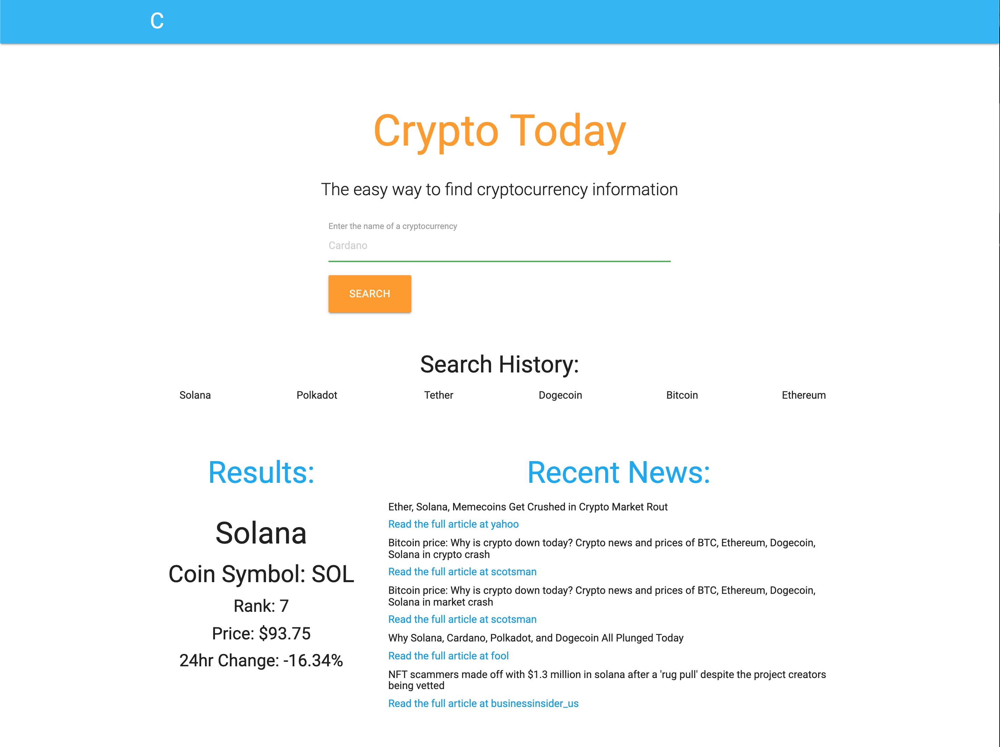
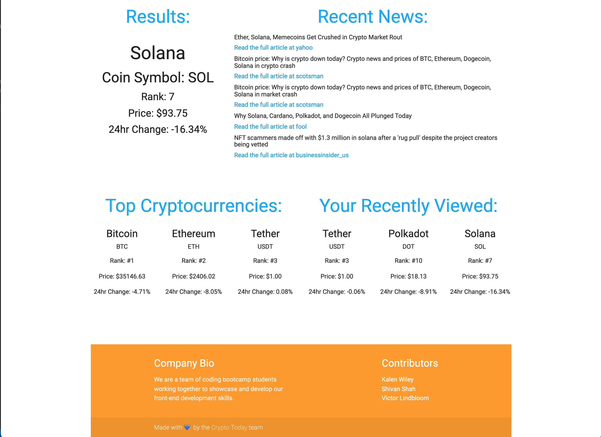

# Crypto Today

## Description:

A simple cryptocurrency data dashboard aimed to help first time crypto investors gain more information before investing their money.

## Purpose/User Story:

AS A first time potential cryptocurrency investor
I WANT to compare multiple cryptocurrencies
SO THAT I can make informed investment decisions. 

## Application Details:

### Features:

* Top three ranked cryptocurrencies' data displays on page load
* User's six most recent searches are remembered and displayed using local storage
* User's three most recent searches data are displayed on the page
* Searching a coin name displays data for the cryptocurrency and related recent news headlines
* Repsonsive layout adjusts to screen size and maintains clean UI

### Technologies:

* HTML
* Materialize CSS Framework
* JavaScript
* CoinCap API
* Newsdata.io API
* Local Storage API

## Screenshots

## Deployed Application

This application is deployed using GitHub Pages and can be accessed via this link: https://kalecodes.github.io/markets-today/ 

## Credit/Resources:
### Contributors: 
    * Kalen Wiley
    * Victor Lindbloom
    * Shivan Shah

Resources: 
    * Materialize CSS Framework (http://archives.materializecss.com/0.100.2/)(see assets folder for license info)
    * CainCap API (https://docs.coincap.io/)
    * Newsdata.io API  (https://newsdata.io/docs)
